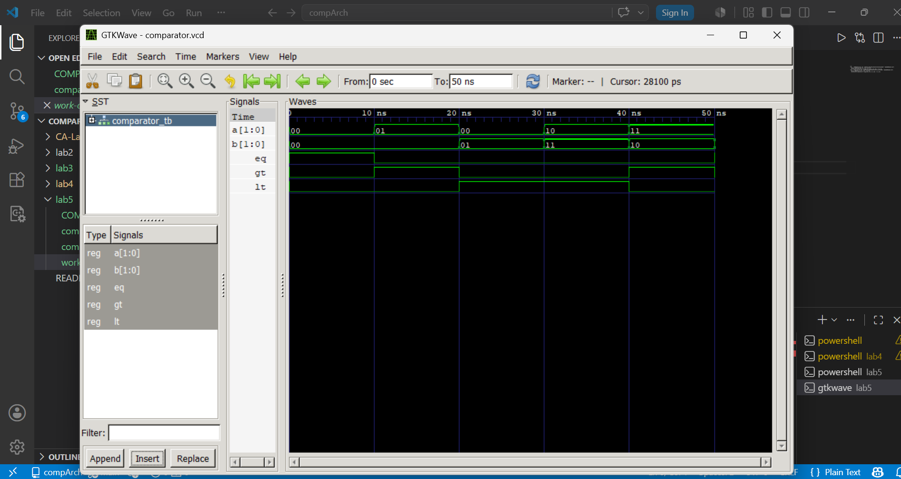

# Lab 5: VHDL Code for Combinational Circuits – Comparator

##  Objective
- To design and simulate a 2-bit magnitude comparator in VHDL.  
- To understand how comparison operations are implemented in hardware.  

---

## Theory

A magnitude comparator compares two binary numbers and produces three output signals:  
- **EQ (Equal):** HIGH when A = B  
- **GT (Greater Than):** HIGH when A > B  
- **LT (Less Than):** HIGH when A < B  

For a 2-bit comparator with inputs A = A1A0 and B = B1B0:  
- EQ = A1 ⊕ B1 · A0 ⊕ B0  
- GT = A1B1 + A1 ⊕ B1 · A0B0  
- LT = A1B1 + A1 ⊕ B1 · A0B0  

---

## Output

---

## Simulation Commands
Run the following commands in your terminal to compile and simulate:

## 1. Analyze (compile) the design and testbench
ghdl -a comparator_2bit.vhd comparator_tb.vhd

## 2. Elaborate the testbench
ghdl -e COMPARATOR_TB

## 3. Simulate and generate the waveform file
ghdl -r COMPARATOR_TB --vcd=comparator.vcd

## 4. Open the waveform in GTKWave
gtkwave comparator.vcd

## Discussion
In this lab, we implemented a **2-bit comparator** in VHDL.  
Key observations:  
- The comparator correctly identifies when two binary inputs are equal, greater, or less.  
- The outputs **EQ, GT, LT** are mutually exclusive — only one is HIGH at a time.  
- Simulation results matched the expected truth table, confirming the correctness of the design.  

---

## Conclusion
This lab demonstrated how **comparison operations** can be implemented in hardware using VHDL.  
We learned how to:  
- Define comparator logic equations for EQ, GT, and LT.  
- Write and simulate the VHDL design.  
- Verify outputs using waveform visualization.  

The experiment reinforced the importance of **combinational logic** in digital design and showed how comparators are fundamental building blocks in processors and control systems.

[def]: ./